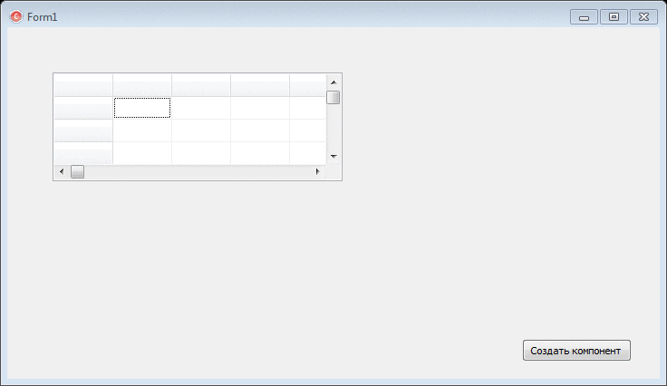
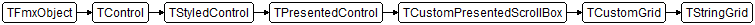

# Creating new component: StringGrid

The app is done as final project of Technology of Programming course. So I made all the tasks programmatically and will introduce You what I have done overall.

Task: To create StringGrid component, which when the F11 key is pressed, the fixed row and column (FixedRow and FixedCol properties) disappear and when F11 is pressed again, they reappear.

Everything was done right.

## Description

**TStringGrid** represents a grid control designed to simplify the handling of strings. Add a **TStringGrid** object to a form to present textual data in a tabular format. **TStringGrid** provides many properties to control the appearance of the grid, as well as events and methods that take advantage of the tabular organization of the grid in responding to user actions. **TStringGrid** introduces the ability to associate an object with each string in the grid. These objects can encapsulate any information or behavior represented by the strings that are presented to the user.

> *From [http://docwiki.embarcadero.com](http://docwiki.embarcadero.com/Libraries/Berlin/en/FMX.Grid.TStringGrid)*